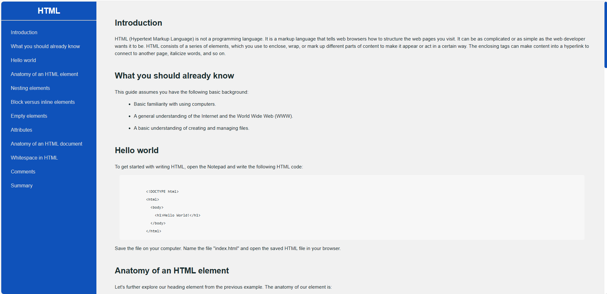

# Technical Documentation Page
Technical documentation is any document that explains the features of the respective product.  
In this project, we are going to create technical documentation of HTML by using HTML and CSS.  
The webpage has a menu section that helps to navigate to different sections of the webpage. 
You can see the survey form at [CodePen](https://codepen.io/Keerti-Vishwkarma/full/jOdzjNr)  

Made with :heartpulse: